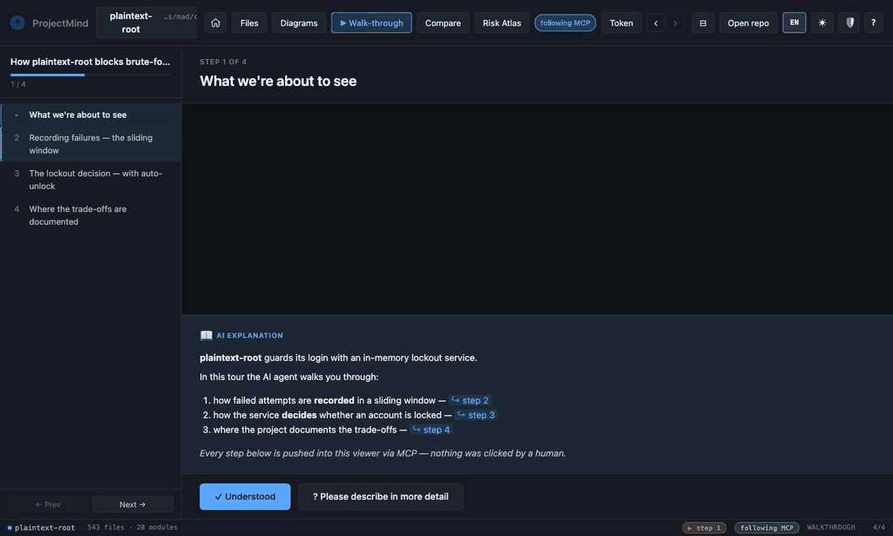
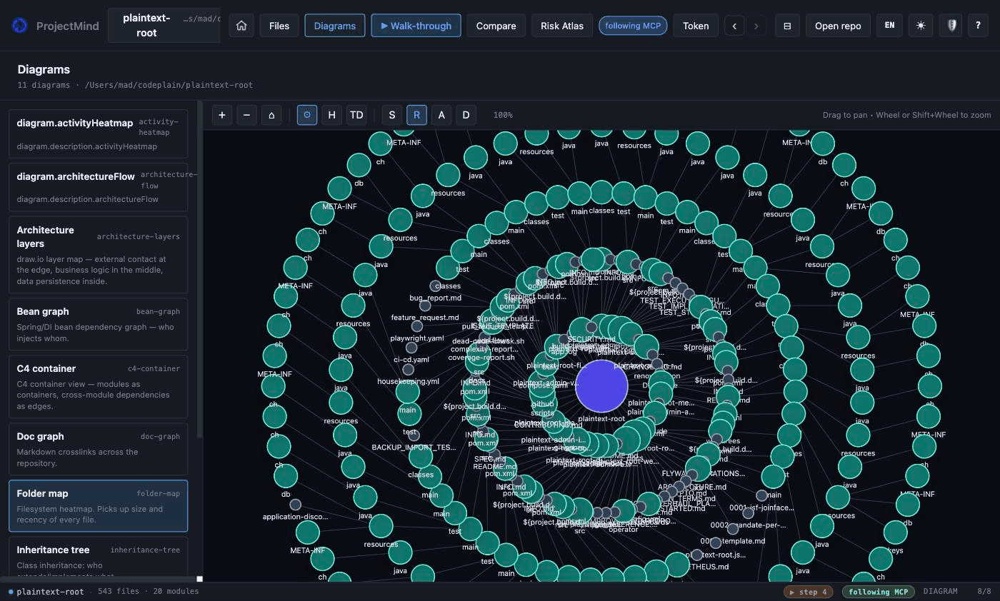
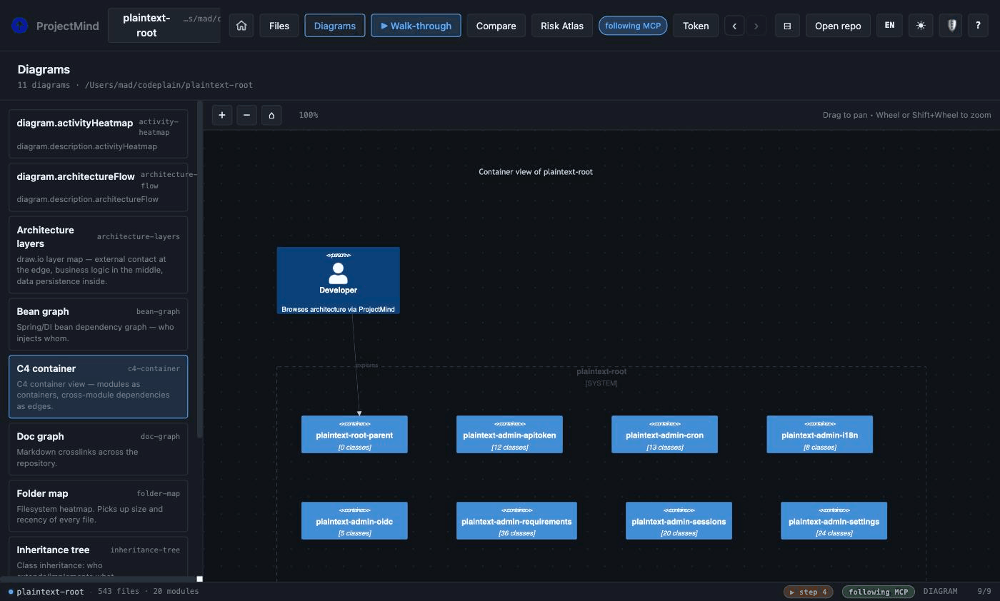
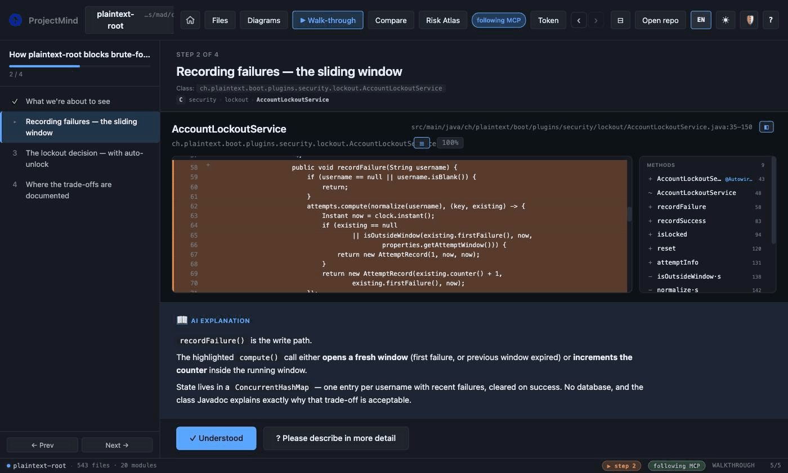

<p align="center">
  
</p>

<h1 align="center">ProjectMind</h1>
<p align="center"><strong>Your project, explained by AI.</strong></p>
<p align="center"><sub>by Plaintext · MPL-2.0</sub></p>

ProjectMind uses AI-ready project maps to explain software architecture,
classes, modules and relationships in a way humans and coding agents can
navigate. It's a lightweight, **read-only** architecture browser for source
code that pairs bidirectionally with LLM-driven coding agents — Claude Code,
ChatGPT / OpenAI Codex, Gemini CLI, Cursor, and any other frontier model
that speaks the **Model Context Protocol (MCP)**.

<p align="center">
  
</p>
<p align="center"><sub>An AI agent authors this tour <strong>live over MCP</strong> — steps, line highlights and narration are pushed into the viewer. No human clicked anything.</sub></p>

> **Status:** v0.11 — MCP server + desktop app for **macOS, Linux and Windows**, with signed auto-updates. Java + Rust language plugins, Spring + Lombok framework recognisers, sixteen diagram types (see the catalogue below — from bean graph and C4 container up to an animated live bean graph and a 3D code city), Markdown + HTML browsers (sandboxed), guided AI walkthroughs with quiz support, presenter mode with PDF tour export, an Architect's Cockpit (risk atlas, pattern-drift detection, semantic tour lookup, morning briefing), live AI-generated HTML/Markdown artifacts, and bidirectional MCP sync between LLM, desktop app and browser.

## Quickstart

Install the desktop app + MCP server with one line. The script picks the
right pre-built bundle for your OS / arch, no build toolchain required.

**macOS / Linux:**

```sh
curl -fsSL https://raw.githubusercontent.com/Plaintext-Gmbh/projectmind/master/scripts/install.sh | sh
```

**Windows (PowerShell):**

```powershell
iwr -useb https://raw.githubusercontent.com/Plaintext-Gmbh/projectmind/master/scripts/install.ps1 | iex
```

The desktop app lands in `/Applications` (macOS), `~/.local/share/projectmind`
(Linux), or `%LOCALAPPDATA%\Programs\ProjectMind` (Windows). The MCP server
binary is installed alongside on your `PATH` so any LLM CLI can launch it.

Re-running the script upgrades to the newest release. Pin a specific version
with `PM_VERSION=v1.2.3 …`. Skip components with `PM_NO_APP=1` or
`PM_NO_MCP=1` (Bash) / `$env:PM_NO_APP="1"` (PowerShell).

When the bash installer detects a supported LLM CLI on `PATH` (currently
`claude` and `codex`) it offers to register `projectmind-mcp` for you with a
single `claude mcp add` / `codex mcp add` call. Override with
`PM_REGISTER=yes` (auto-register every detected CLI without prompting) or
`PM_REGISTER=no` (skip the prompt and just print the manual command).

## Why

Modern AI-assisted development with CLI agents is great — until you want to *see* what just changed, *visualise* how the architecture is evolving, or *drill into* the structure without firing up a heavy IDE.

`projectmind` aims to be the missing piece:

- **Standalone** desktop app (Mac & Linux); not a VS Code extension.
- **Read-only** — no editing, no builds. Just an "architecture lens".
- **MCP-bidirectional** — your LLM can say *"show class X with lines 42-58 highlighted"* and the viewer renders it. You can mark code regions and the selection flows back into the conversation.
- **Plugin-based** — languages (Java, Kotlin, TypeScript, …), frameworks (Spring, Lombok, JSF, …) and visualisations (bean graph, package tree, C4, …) are all plugins.

## GUI tabs

The Tauri shell's main views (each disabled until a repository is open):

- **Files** — module sidebar, class list, source viewer with stereotype filters, package drilldown. Also hosts every Markdown file in the repo (rendered preview, mermaid blocks, embedded images) and every `.html` / `.xhtml` / `.htm` / `.jsp` / `.vm` / `.ftl` file plus HTML snippets extracted from `.java` / `.kt` / `.groovy` / `.scala` string literals (Java text blocks supported). Toggle Rendered ↔ Source; Rendered uses a strict sandbox iframe (no JS, no network) so untrusted repo content stays inert.
- **Diagrams** — the sixteen-kind diagram catalogue below; click a node to drill in. A collapsible mini-map overlay (thumbnail + viewport rectangle, click/drag to pan) keeps you oriented on large graphs.
- **Compare** — branch & tag compare with commits / changed files / unified diff sub-tabs.
- **Risk Atlas** — per-class risk (churn + complexity + coverage + fan-in) as a treemap.
- **Patterns** — architecture-drift compliance heatmap (patterns × modules); violation cells drill into `file:line` lists.

A **Tour** / **Present** button appears while a guided walkthrough is active, and an **Artifact** button while an AI-pushed artifact is loaded.

## Diagram catalogue

Sixteen diagram kinds. Core contributes the filesystem- and git-based ones
unconditionally; language and framework plugins contribute the rest, so the
sidebar only offers what the open repo can actually render:

- **Bean graph** — Mermaid injection graph, subgraphs per Maven module, colour-coded by stereotype.
- **Live bean graph** — the interactive Cytoscape sibling of the bean graph: pan/zoom, since-ref diff overlay, animated morph, and the living modes below.
- **Package tree** — Java packages / Rust module namespaces as a drillable tree.
- **Inheritance tree** — `extends` / `implements` / Rust trait-impl edges; external supertypes grouped separately.
- **Folder map** — treemap of the working tree with hierarchy / solar / top-down layouts; colour by structure, recency, author or diff (with legends).
- **Doc graph** — the repo's markdown files as a clickable graph (network / radial / orphans layouts, orphan + dangling-link counts).
- **C4 container** — one container per module, rendered via draw.io (exportable).
- **C4 model (editable)** — the round-trip sibling of C4 container ([#142](https://github.com/Plaintext-Gmbh/projectmind/issues/142)): `scaffold_c4_model` writes `docs/architecture.dsl` (a Structurizr-DSL subset) once, you hand-edit it in Git, and this kind parses it back to Mermaid. ProjectMind never overwrites the file, so the architecture is yours to own — JVM-free, no Structurizr CLI. When the code grows, the view's **Update model** button (or the `merge_c4_model` tool) folds the new modules, classes and relations in **additively** — your own edits, hand-added elements and comments are preserved byte-for-byte.
- **C4 component** — the container-level zoom ([#142](https://github.com/Plaintext-Gmbh/projectmind/issues/142)): pick one module from a dropdown and see its classes as C4 components with their relations (intra-module `Rel`s; cross-module dependencies collapse to `Container_Ext` boundaries). Reuses the `bean_graph_data` payload — no new backend data — and the top classes by in-module fan-in are shown when a module is too dense to draw legibly.
- **Architecture layers** — layered draw.io view, kept for export.
- **Architecture flow** — interactive Controller / Service / Repository / Entity bands with flow arrows whose width tracks the relation count.
- **Module chord** — cross-module coupling as a circular chord diagram.
- **Activity heatmap** — GitHub-style 7×52 commit calendar with streaks and a top-author summary.
- **Timeline river** — per-module commit activity over the last 24 months; answers "when did module X go active or quiet".
- **Language stats** — file / extension breakdown of the working tree.
- **Code city** — the codebase as a 3D city (three.js, orbit camera): districts are folders, building height tracks file size, colour tracks the risk score.

The live bean graph has three animation modes (one driver at a time): **Flow**
simulates a request wave travelling from the controllers towards the
repositories along the real relation edges; **Pulse** joins the repo's
24-month commit activity onto the graph so modules with fresh commits visibly
beat; **Cinematics** plays the commit timeline like a film — press play and
watch the architecture diff morph step by step. All three are frontend-only
overlays over data the MCP server already serves.

## What it looks like

A 21-module Spring Boot monorepo (543 classes), straight after `open_repo`:

| Folder heatmap | C4 container view | Guided AI walkthrough |
|---|---|---|
|  |  |  |

Dark and light themes, five UI languages, resizable panes throughout.

## What works today

The Phase 1 MVP ships a **Rust MCP server** (`projectmind-mcp`) that any
MCP-aware client — Claude Code, ChatGPT, Gemini CLI, Cursor, or your own
custom agent — can connect to. It implements:

| Tool | What it does |
|---|---|
| `open_repo` | Open a repository. Detects Maven multi-module layouts (any `pom.xml`) and Cargo workspaces (any `Cargo.toml` with a `[package]`); falls back to a single module otherwise. |
| `repo_info` | Summary (modules, classes) of the active repo. |
| `module_summary` | Per-module class count and stereotype histogram. |
| `list_module_files` | List PDFs and images inside a module's root (source files are covered by `list_classes`). |
| `list_classes` | List parsed classes (filter by stereotype). |
| `find_class` | Case-insensitive substring search by simple or fully-qualified name. |
| `class_outline` | Methods, fields, annotations and visibility of a class — without source. |
| `docs_for_class` | Repo-internal Markdown documents that mention a class or link to its source file, ranked by precision (source-file link > FQN > inline-code name > bare distinctive name). The bridge from code to the ADRs / design docs / runbooks behind it. |
| `show_class` | Source of a class with optional line-range highlights. |
| `relations` | The full bean / injection graph as JSON: `{from, to, kind, cross_module}` edges. |
| `list_changes_since` | Files changed since a given git ref. |
| `show_diff` | Unified diff between two refs (or ref vs working tree). |
| `list_refs` | Local branches and tags with name, kind and target SHA — branches first, `master`/`main` floated to the top. |
| `file_recency` | Per-file recency index: every path's most-recent commit (sha, summary, age), newest-first. The data behind the recency heatmap and author overlay. |
| `commit_activity` | Per-module commit activity over the last 24 months — the data behind the timeline river; answers "when did module X go active or quiet". |
| `show_diagram` | Diagram source for a given kind — Mermaid bean graph (subgraphs per Maven module, colour-coded by stereotype), package tree, inheritance tree and friends. The live/3D kinds (`bean-graph-live`, `timeline-river`, `code-city`) are rendered by the viewer from their own data endpoints. |
| `list_html` | List HTML / XHTML / JSP / Velocity / FreeMarker template files in the open repository. |
| `list_html_snippets` | Scan source files (`.java`, `.kt`, `.groovy`, `.scala`, incl. Java text blocks) for HTML snippets in string literals — filtered to ≥2 tags so XML namespace declarations and short error strings drop out. |
| `plugin_info` | List active language and framework plugins. |
| `risk_atlas` | Composite per-class risk scores from four signals — git churn, cyclomatic complexity, test coverage (JaCoCo/LCOV/Cobertura, gracefully absent), fan-in — with a `why` hint per class (`hot+uncovered+central`). Find the hotspots before reading any source. |
| `pattern_check` | Architecture-drift detection: five Spring-flavoured detectors (`repository`, `layered`, `di_only`, `tx_on_service`, `no_static_state`) returning per-module compliance counts and `file:line` violations with confidence scores. Configurable via `.projectmind/patterns.toml`. |
| `architect_briefing` | Morning briefing — what got *worse* since you last looked: diffs the current health snapshot against a previous session and reports new hotspots, pattern drift and risk deltas. Call this first in a session. |
| `walkthrough_query` | Semantic lookup over curated tours: matches a natural-language question against every tour step and returns the best tour's steps with a confidence — the preferred way to answer "how does X work" before grepping. Answers `fallback: "grep"` when no tour matches. |
| `tour_scaffold` | Machine skeleton for a "welcome to this repo" tour: ranks the modules worth touring (coupling + size + 90-day activity) and returns ready-made step targets plus facts bullets — the LLM writes the narration and calls `walkthrough_start`. `materialize: true` persists a template-narrated tour directly. |
| `self_demo` | One-click self-demo (V5.3): ranks the repo like `tour_scaffold`, materialises a template-narrated tour, persists it, and opens it in **present + autoplay** mode — the viewers enter Presenter Mode and the deck advances itself (narration-length timer + OS TTS) with no client-LLM narration. Exactly what the `▶ Demo` button does. Any keypress/click stops it; the demo ends on the last step. |
| `scaffold_c4_model` | Scaffold an **editable** C4 model ([#142](https://github.com/Plaintext-Gmbh/projectmind/issues/142)): write `docs/architecture.dsl` (a Structurizr-DSL subset) so the architecture becomes a hand-editable, versioned Git file — JVM-free, no Structurizr CLI. Generated once from the same data as the `c4-container` diagram; **never clobbers** an existing file (returns `created:false`), so after the first scaffold the file is yours. Render the edited model with the `c4-model` diagram kind. |
| `merge_c4_model` | **Round-trip** the editable C4 model ([#142](https://github.com/Plaintext-Gmbh/projectmind/issues/142)): fold **new** code structure into `docs/architecture.dsl` while preserving every edit you made. Strictly **additive** — inserts only the containers / components / relationships the code has but the DSL lacks; **never** deletes or changes existing elements, rewritten descriptions, hand-added external systems / actors / relationships, or comments (all survive byte-for-byte). Scaffolds fresh if the file is absent. Returns `{ path, created, added_containers, added_components, added_relationships }` (all `added_*` zero when already up to date). The `c4-model` view's **Update model** button calls this. |
| `walkthrough_start` | Start a guided tour: pushes the tour body + step 0 to every open viewer. Replaces any previous tour; auto-launches the desktop GUI if nothing is open. |
| `walkthrough_append` | Append one step to the active tour without moving the pointer — stream a tour while authoring it. |
| `walkthrough_set_step` | Move the active tour's pointer to a 0-based step index (clamped). |
| `walkthrough_clear` | End the active tour; viewers return to the previous view. |
| `walkthrough_feedback` | Read the user's feedback events on the active tour (one entry per *Verstanden* / *Genauer* click), so the LLM can expand steps that were flagged. |
| `view_class` | Open a class in every running viewer (desktop GUI and/or browser webapp); auto-launches the desktop GUI if none is up. |
| `view_file` | Open an arbitrary file in every running viewer — Markdown rendered (mermaid + images), everything else as source. |
| `view_diff` | Open the diff view between two refs (or ref vs working tree) in every running viewer. |
| `view_diagram` | Open one of the sixteen diagram kinds in every running viewer. |
| `start_gui` | Launch the ProjectMind desktop app if it isn't already running (the `view_*` tools auto-launch on demand, so call this only to bring up the window before any view intent). Honours `$PROJECTMIND_APP` for an override path. |
| `open_browser_repo` | Start the in-process browser host that serves the ProjectMind webapp at a tokenized URL — same UI as the Tauri shell, but reachable from any browser. Default binds on `127.0.0.1`; pass `lan: true` to bind on `0.0.0.0` so the URL works from another device on the same WLAN (iPad / phone / second laptop). The bearer token in the URL fragment gates every API call. |
| `browser_status` | Return the running browser host's bind address, tokenized URLs and open repo, or null if no host is started. Side-effect free — handy to re-surface the URL/token without restarting the host. |
| `stop_browser` | Forget the cached browser host status so the next `open_browser_repo` starts fresh. |
| `present_artifact` | Render an AI-generated HTML or Markdown artifact live in every open viewer. Content is passed inline (not read from the repo), so the LLM can show generated dashboards, notes or diagrams without writing them to disk. HTML renders inside a sandboxed, CSP-locked iframe (no scripts, no network); Markdown renders like a `.md` file (mermaid + images). Re-use the `id` to iterate/stream. Max ~2 MB. |
| `list_artifacts` | List the pushed artifacts (id, title, format, size, created/updated) — bodies excluded. |

The browser host is the natural answer to *"open this repo on my iPad
while I keep working on the laptop"*: ask the LLM to call
`open_browser_repo` with `lan: true`, the response carries a
`http://<lan-ip>:<port>/#token=…` URL you open on the second device.
Both the Tauri desktop window and the browser tab subscribe to the
same shared statefile, so any subsequent `view_*` / `walkthrough_*`
push from the LLM mirrors to whichever viewers happen to be open.

Active language plugins in Phase 1:

- **Java** — Tree-sitter parser. Classes, interfaces, enums, records; methods, fields, annotations, visibility.
- **Rust** — Tree-sitter parser. Structs, enums, traits, unions; `impl` blocks attach methods and lift `impl Trait for T` as annotations on `T`. Module namespace is derived from the nearest `[package].name`.

Active framework recognisers in Phase 1:

- **Spring** — `@Service`, `@RestController`, `@Controller`, `@Component`, `@Repository`, `@Configuration`. Constructor and field injection (`@Autowired`, `@Inject`, `@Resource`) become Mermaid edges.
- **Lombok** — `@Data`, `@Value`, `@Builder`, `@SuperBuilder`, `@*ArgsConstructor`, `@ToString`, `@EqualsAndHashCode`, `@Slf4j`/`@Log*`, `@Getter`, `@Setter`, `@With`, … attached as a `lombok` stereotype with the detected annotations in `class.extras`.

Smoke-tested against real codebases: a 21-module Spring Boot Maven monorepo parses to **~500 classes** with stereotype histograms and a Mermaid bean graph grouped by module; an 8-crate Cargo workspace (this repo) parses to ~60 classes with per-crate modules.

## Build the MCP server (Ubuntu / Debian)

This is the path you want for **using `projectmind` from any MCP-aware
agent (Claude Code, ChatGPT, Gemini CLI, …) on Ubuntu** — no GUI required.

The repo ships an installer for the impatient:

```bash
git clone git@github.com:Plaintext-Gmbh/projectmind.git
cd projectmind
./scripts/install-ubuntu.sh             # MCP server only
# or:
./scripts/install-ubuntu.sh --with-app  # also build the Tauri shell
```

The script installs build prerequisites, the Rust toolchain (via rustup, if missing), then builds and prints a ready-made `.mcp.json` snippet. If you'd rather install manually:

```bash
sudo apt update
sudo apt install -y build-essential pkg-config libssl-dev cmake git curl
curl --proto '=https' --tlsv1.2 -sSf https://sh.rustup.rs | sh -s -- -y
source "$HOME/.cargo/env"

git clone git@github.com:Plaintext-Gmbh/projectmind.git
cd projectmind
cargo build --release --bin projectmind-mcp

# Result: target/release/projectmind-mcp
```

## Build the MCP server (macOS)

```bash
# Prerequisites — Homebrew + Rust
brew install rustup-init || true
rustup-init -y
source "$HOME/.cargo/env"

git clone git@github.com:Plaintext-Gmbh/projectmind.git
cd projectmind
cargo build --release --bin projectmind-mcp
```

## Build the Tauri shell (optional, GUI)

The Tauri app is the read-only graphical browser. It is the same engine, just with a UI on top.

### Ubuntu / Debian

```bash
# Tauri prerequisites
sudo apt install -y \
  libwebkit2gtk-4.1-dev libgtk-3-dev libayatana-appindicator3-dev \
  librsvg2-dev libsoup-3.0-dev libjavascriptcoregtk-4.1-dev patchelf

# Node toolchain (for the frontend)
curl -fsSL https://get.pnpm.io/install.sh | sh -

# Build
cd app
pnpm install
pnpm tauri build
```

### macOS

```bash
# Node toolchain
brew install pnpm

cd app
pnpm install
pnpm tauri build
```

Run the app in dev mode (live-reload):

```bash
cd app && pnpm tauri dev
```

## Use with an MCP-aware agent

ProjectMind speaks the **Model Context Protocol (MCP)**, so any frontier
LLM client that supports MCP can drive it: Claude Code, ChatGPT desktop,
Gemini CLI, Cursor, Continue, or your own scripted agent. Add the server
to whichever config the client uses (e.g. `.mcp.json` for Claude Code,
`mcp_settings.json` for Cursor):

```json
{
  "mcpServers": {
    "projectmind": {
      "type": "stdio",
      "command": "/absolute/path/to/projectmind-mcp",
      "env": {
        "PROJECTMIND_LOG": "info"
      }
    }
  }
}
```

### Where is `projectmind-mcp` on disk?

Pick whichever of these you have installed:

- **Desktop app installed** — the MCP server is bundled next to the GUI
  binary, so you can point your client straight at the in-app path. No
  separate install step:
  - **macOS:** `/Applications/ProjectMind.app/Contents/MacOS/projectmind-mcp`
  - **Linux (`.deb` / `.AppImage`):** `/usr/bin/projectmind-mcp` (`.deb`
    installs to `/usr/bin/`; `.AppImage` mounts a temporary FUSE root —
    extract the AppImage with `--appimage-extract` if you need the binary
    on a stable path)
  - **Windows (`.msi`):** `C:\Program Files\ProjectMind\projectmind-mcp.exe`
- **MCP-only install** (without the desktop app) — use the standalone
  tarball from the [Releases page](https://github.com/Plaintext-Gmbh/projectmind/releases/latest)
  or the helper scripts under [`scripts/`](scripts/). The binary lands
  wherever you placed it (commonly `~/.local/bin/projectmind-mcp`).
- **From source** — `target/release/projectmind-mcp` after
  `cargo build --release --bin projectmind-mcp`.

Claude Code users can register the bundled binary in one line:

```bash
# macOS
claude mcp add projectmind /Applications/ProjectMind.app/Contents/MacOS/projectmind-mcp
```

Re-running the same command after a desktop-app upgrade is a no-op, so
the MCP server stays in lockstep with the GUI version automatically.

Restart the client. From a session, you can then ask things like:

- *"Open the repo at `/home/me/projects/my-spring-app` and tell me how many services and controllers there are per module."*
- *"Find any class containing `Auszahl` and outline the most relevant one."*
- *"Show me the `UserService` class — highlight lines 80-95."*
- *"Which files changed since HEAD~5? Group them by module."*
- *"Render the bean graph as a Mermaid diagram."*

The agent will pick the right tool calls from the list above.

### Pre-built binary

The latest release on the
[Releases page](https://github.com/Plaintext-Gmbh/projectmind/releases/latest)
ships `projectmind-mcp` and desktop app bundles where the GitHub runners
can build them. New releases are produced by the **Auto-Release** workflow
from the Actions tab; it bumps the version, opens a PR, merges, tags, and
publishes in one shot.

## Presenter mode & tour recording

A walk-through isn't just for one screen. Two Cockpit 2.6 features turn a tour
into a shareable architecture presentation:

**Presenter mode** — press **`P`** (or the header *Present* button) while a tour
is active to drop into a full-screen slide deck: sidebar hidden, larger fonts,
a `3 / 12` step counter, and single-key navigation.

| Key | Action |
|---|---|
| `←` / `→` | previous / next step |
| `n` | toggle the TTS narrator (reads the step narration aloud) |
| `r` | overlay the risk-atlas badges for the current class |
| `p` | overlay the pattern-compliance check for the current class |
| `+` / `-` / `0` | font scale up / down / reset (1.0 · 1.25 · 1.5) |
| `Esc` | leave presenter mode |

The narrator uses the OS speech engine — `say` on macOS, `espeak` on Linux
(install it for the narrator; without it the toggle is a silent no-op with a
hint). In the browser build (`open_browser_repo`) it uses the Web Speech API on
the client device instead. An MCP client that generates richer narration than
the authored step text can pass that string to the narrator directly — the
presenter just speaks whatever it is handed.

**Recording** — export the active tour to a self-contained file that reads
without ProjectMind installed:

```bash
# Structured PDF (the default deliverable): one page per step with title,
# file:line, the highlighted code snippet, narration, and any risk / pattern
# annotations. Pure Rust — no headless browser, no FFmpeg.
projectmind-mcp record <tour-id> --output tour.pdf     # or `active` for the live tour
projectmind-mcp record active --output tour.pdf --repo /path/to/repo

# MP4 export is gated behind the `record-mp4` cargo feature (needs system
# FFmpeg). Without it, an .mp4 output fails with a clear "enable record-mp4
# feature" message and the encoder never compiles into the default build.
cargo build --release --bin projectmind-mcp --features record-mp4
```

`record` resolves the active tour on disk (the one `walkthrough_start` wrote).
Pass `--repo` (or rely on the repo recorded in the statefile) so `class` /
`risk` steps embed real source lines plus risk-atlas badges and `pattern` steps
embed the drift violations; without a repo it still exports titles + narration.

## Tests / development

For day-to-day work, use the small `./build` helper:

```bash
./build dev      # Tauri app with hot reload
./build check    # cargo fmt --check + cargo clippy
./build test     # cargo test --workspace --all-targets + doctests
./build ci       # check + test
./build mcp      # release-build and smoke-test projectmind-mcp
./build app      # desktop app bundle for this machine
./build dist     # app bundle plus tar.gz + sha256 package
```

The lower-level CI wrapper is still available when you need exactly the
workflow commands:

```bash
./scripts/ci.sh check
./scripts/ci.sh test
./scripts/ci.sh all
```

CI runs on **Ubuntu 22.04** and **macOS 14** for every push and pull request, plus a Linux release-build smoke test.

## Architecture

A Cargo workspace with seven crates plus a Svelte frontend:

| Crate | Purpose |
|---|---|
| `crates/plugin-api` | Public traits and types (no implementations) |
| `crates/core` | Repo loader, file walker, plugin pipeline, Maven + Cargo discovery, git helpers |
| `crates/mcp-server` | The `projectmind-mcp` binary (JSON-RPC over stdio) |
| `plugins/lang-java` | Java parser via Tree-sitter |
| `plugins/lang-rust` | Rust parser via Tree-sitter |
| `plugins/framework-spring` | Spring stereotypes + bean graph |
| `plugins/framework-lombok` | Lombok annotation recogniser |
| `app/src-tauri` | Tauri shell (Rust backend exposing Tauri commands) |
| `app/src/` | Svelte + TypeScript frontend with Mermaid integration |

Phase 1 plugins are **statically registered**. Phase 2 will add dynamic loading from a `./plugins/` directory next to the binary, so third-party plugins can drop in `.so` / `.dylib` files.

## Reference docs (in the repo)

- [`docs/architecture.md`](docs/architecture.md) — workspace layout, plugin API, MCP tool schemas. Living reference, kept in sync with the code.
- [`docs/architect-briefing.md`](docs/architect-briefing.md) — the Cockpit 2.7 morning briefing: session log, `architect_briefing` MCP tool, and the `projectmind briefing` CLI.
- [`docs/SYNC.md`](docs/SYNC.md) — how the MCP server and the Tauri GUI stay in sync (statefile + view intents).
- [`docs/branding.md`](docs/branding.md) — colour, typography, logo specs.
- [`docs/reviews/`](docs/reviews/) — historical architecture reviews.

## Roadmap & planning

The roadmap and feature backlog now live on **GitHub**:

- **[Issues](https://github.com/Plaintext-Gmbh/projectmind/issues)** — concrete, schedulable work items (bugs, features, sub-tasks of epics)
- **[Project board](https://github.com/Plaintext-Gmbh/projectmind/projects)** — Kanban view of what's in flight
- **[Discussions](https://github.com/Plaintext-Gmbh/projectmind/discussions)** — vision, longer-form design conversations, and visualisation sketches. The [Vision & Roadmap thread](https://github.com/Plaintext-Gmbh/projectmind/discussions/58) is the canonical place for high-level direction.

Phase summary:

- **Phase 1 (done):** MCP server with Java + Spring + Lombok plugins, Rust plugin, package tree, bean graph, folder map, diff view, Markdown + HTML browsers, walkthrough mode, core MCP tools, Tauri shell with bidirectional MCP sync.
- **Phase 2 (in progress):** Annotation round-trip, ~~draw.io embed~~ (`.drawio` files render via the embedded diagrams.net viewer), Confluence MCP bridge, dynamic plugin loading from `./plugins/`.
- **Phase 3:** Plugin marketplace, more languages, JSF / PrimeFaces preview, C4 diagram generator.

## Contributing

See [CONTRIBUTING.md](CONTRIBUTING.md). The project is in early design — discussions, ideas, and visualisation sketches are very welcome.

## License

[MPL 2.0](LICENSE) — Mozilla Public License Version 2.0.
