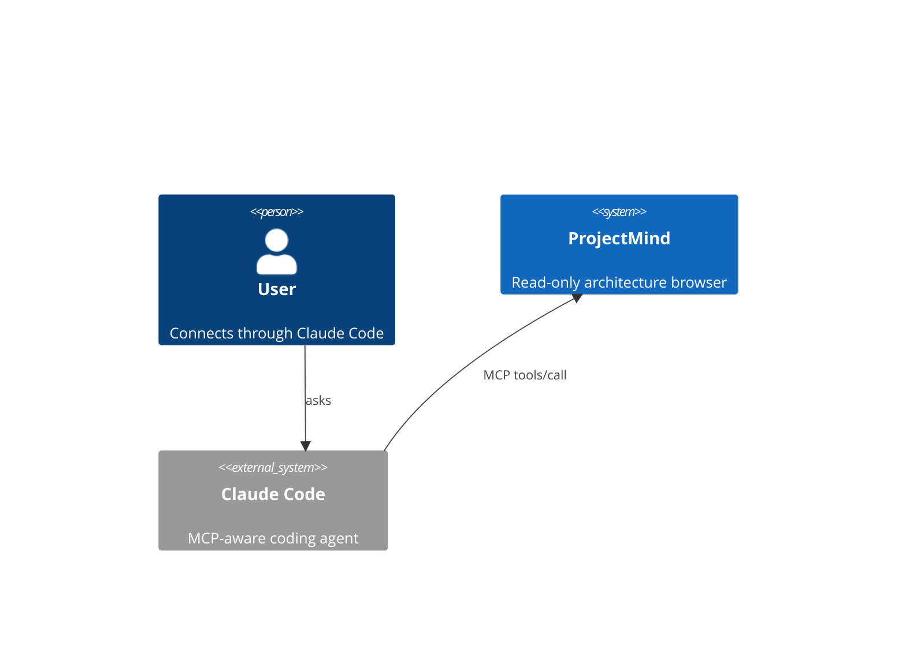

# Architecture maps — evaluation & recommendation

> Scope of [#62](https://github.com/Plaintext-Gmbh/projectmind/issues/62): pick which of the
> three candidate architecture-map concepts (Code-City, Dependency wheel, C4) are worth
> landing as `viz-*` plugins in the Diagrams tab. UX details for each one belong in their
> own follow-up issue once the concept is greenlit.

## TL;DR

| Concept | Recommendation | Cost (LOC + deps) | Lands as |
|---|---|---|---|
| **C4 (Context / Container / Component)** | **Land** | ~free (Mermaid 11.x already shipped) | Generated `flowchart` / `C4Context` blocks for an existing module, no new runtime |
| **Dependency wheel** | **Land** | ~30 KB (`d3-chord` + `d3-shape`) | New diagram kind `dep-wheel`, computes its data from the existing `relations()` output |
| **Code-City (3D)** | **Defer** | +600 KB min (`three` + `@threlte/core`) and a permanent maintenance tax | Park as a "wow-factor" candidate in [#66](https://github.com/Plaintext-Gmbh/projectmind/issues/66), revisit if a sketch shows it tells a story we can't tell otherwise |

If you only want to read one section, jump to [Recommendation](#recommendation).

---

## What we already ship

The Diagrams tab today renders three diagram kinds, all via the Mermaid runtime that
already lives in `app/package.json`:

- `bean-graph` — Spring beans as nodes, dependencies as edges (per-class colouring,
  recency / author overlays from #63).
- `package-tree` — hierarchical packages.
- `folder-map` — nested boxes with three layouts (`hierarchy`, `solar`, `td`) and the
  recency / author colouring layers from #63.

The structural data each architecture-map concept would need (modules, classes,
relations) is already produced by `core::Engine::open_repo` and exposed via the
`module_summary`, `list_classes`, and `relations` MCP tools. Nothing in this evaluation
requires new parsing — only new rendering.

## C4 (Context / Container / Component / Code)

> [Structurizr](https://structurizr.com/) and
> [PlantUML C4](https://github.com/plantuml-stdlib/C4-PlantUML) were the candidates
> named in the issue. Both bring a separate runtime: Structurizr DSL needs a JVM,
> PlantUML needs a `plantuml.jar` or a hosted renderer.

Mermaid 11.x ships an experimental `C4Context` / `C4Container` / `C4Component`
diagram kind that produces the same boxes-and-relationships notation, in pure JS,
inside the renderer we already pay for. Concretely:

That sample renders today in the Markdown tab — the same `mermaid.run({ nodes })`
pipeline the `bean-graph` uses. The implementation work for "C4 as a diagram kind"
is therefore:

1. Add `c4-context` (and later `c4-container`, `c4-component`) to the
   `diagram_schema` enum in `crates/mcp-server/src/tools.rs`.
2. Generator in `crates/core/src/diagram.rs` that walks the open `Repository` and
   emits a Mermaid C4 source string. The Container view is a near-trivial mapping
   from `MavenModule` / `CargoCrate` (one Container per module, edges from the
   existing relations).
3. Wire the new diagram kind into `DiagramView.svelte` (the renderer code path is
   unchanged — Mermaid eats it).

The Context view is harder than the Container view because "what's external to this
system" isn't something the parser knows about. Two paths forward:

- **Annotation-driven.** A repo can declare its actors / external systems in
  `.projectmind/annotations.json` (the file already exists, the schema is
  forward-compatible — see `docs/persistence.md`). The C4 generator then merges
  declared externals with parsed internals.
- **Heuristic.** Walk the public API surface (Spring `@RestController`, exported
  Rust `pub fn` in `lib.rs`) and treat each entry point as an "Actor" facing in.
  Less accurate but zero-config.

Recommend shipping the **Container** view first (cheap, mechanical), then the
annotation-driven Context view once we have at least one user repo with C4
annotations to validate against. The Component view is layered on top — it's
"Container view, but scoped to one module" — and is essentially a free follow-on.

The Code view (the fourth C4 layer — class diagrams) is what the existing
`bean-graph` already does, just with a different visual vocabulary. Don't ship it
twice.

### Trade-offs

- ✅ Zero new runtime dependency.
- ✅ Slot fits the existing `<select>` switcher in the Diagrams tab.
- ✅ Markdown tab renders the same source — copy-pasteable into design docs.
- ⚠️  Mermaid's C4 support is marked experimental and the visual quality is
   noticeably below Structurizr's. If a user complains about layout aesthetics
   the answer is "yes, that's the deal we made" — not "we'll fix Mermaid".
- ⚠️  The Context view requires either annotations or a heuristic. Be honest in
   the UI about which one is in play.

## Dependency wheel

The `relations()` tool already produces a flat list of
`(source_class, target_class, kind)` edges. A chord diagram is one of the cleanest
ways to surface "everything in module X is talked to by everything in modules
Y, Z, W" — much easier to scan than the same data as a force-directed graph
when there are >50 modules.

[`d3-chord`](https://d3js.org/d3-chord) plus [`d3-shape`](https://d3js.org/d3-shape)
is the de-facto choice. Together they're ~30 KB minified. No DOM-heavy framework
required — we render into an inline SVG and let Svelte handle the lifecycle.

Implementation outline:

1. New diagram kind `dep-wheel` in the same enum + generator slot as the C4 work.
2. Generator builds an N×N adjacency matrix where N = module count and
   `M[i][j]` = number of relation edges from module `i` to module `j`.
3. Svelte component `<DepWheel>` consumes the matrix, renders chords with
   hue-stable per-module colouring (reuse `authorHue` from `DiagramView.svelte`
   so author and module palettes don't collide).
4. Click-on-arc → `view_class` for the heaviest class in that module
   (the existing drill-down behaviour).

### Trade-offs

- ✅ One small dep, no framework lock-in.
- ✅ Best-in-class density for "who depends on whom" at the module layer.
- ⚠️  Chord diagrams scale to ~30 entities cleanly. Beyond that they need
   grouping — likely "auto-collapse modules with <2 outgoing edges into an
   `other` arc". Spec that as part of the implementation issue.
- ⚠️  No drill-down into individual classes from the wheel itself; the second
   click has to flip back to the bean graph to be useful.

## Code-City (3D)

Code-City answers "what does the size and density of this codebase feel like?"
The visual is striking, especially as a one-screen demo. But:

- `three` is ~600 KB minified; `@threlte/core` adds another ~80 KB and pulls in
  its own renderer integration with Svelte 5. The bundle today is roughly
  1.1 MB; this single visualisation would push it past 1.7 MB.
- 3D needs a per-frame render loop — currently the app has no `requestAnimationFrame`
  consumers and the WebView idles at ~0% CPU. Adding one means revisiting battery
  cost on macOS / Linux laptops.
- The "what it tells you" question is weak. LOC-as-height and method-count-as-
  footprint are proxies for code smell that the bean graph + folder map already
  surface more directly. We'd be paying a heavy bundle cost for a different
  vocabulary, not a different question.

The right place for Code-City is as a **sketch under [#66](https://github.com/Plaintext-Gmbh/projectmind/issues/66)** ("Wow-factor / experimental"). If a sketch
demonstrates an interaction we can't get from the 2D maps — the obvious one is
"first-person flythrough as a way to navigate", which #66 already lists as a
candidate — that's when the bundle cost becomes worth re-evaluating.

## Recommendation

Ship in this order, each in its own PR:

1. **C4 Container view** — smallest possible step. New diagram kind, Mermaid
   passthrough, generator that maps modules → containers. Validates the slot in
   the diagrams tab and gives us something to point at.
2. **Dependency wheel** — adds `d3-chord` + `d3-shape`, new `<DepWheel>` Svelte
   component, drill-back to bean graph on click. Bumps the bundle by ~30 KB.
3. **C4 Context (annotation-driven)** — only after we have at least one repo
   with `.projectmind/annotations.json` declaring externals. Otherwise we'd be
   shipping a feature with nothing to show.

Defer Code-City to [#66](https://github.com/Plaintext-Gmbh/projectmind/issues/66)
unless and until a sketch lands that justifies the bundle cost.

Each of the three "land" items deserves its own follow-up issue when this PR
merges; #62 itself can then close out as scoped.
